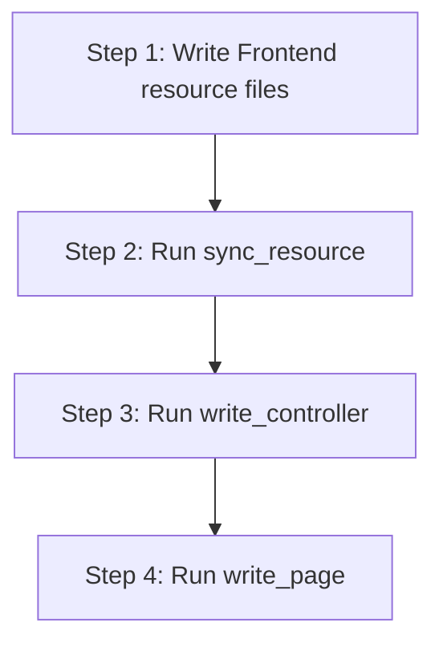

# Declarative Resource-Based CRUD System

This system uses a declarative approach where the frontend defines a resource schema, and the backend automatically matches it. As an agent with a restricted toolset, you will follow a specific sequence of steps to create a complete CRUD interface for a new database-backed resource.

## Restricted Toolset & Workflow

You have three main tools available for creating and syncing resource features:
1. `sync_resource`: Automatically reads a frontend resource definition and generates/syncs the backend Doctrine Entity.
2. `write_controller`: Writes a Symfony backend controller for the API endpoints.
3. `write_page`: Writes a React/Next.js page component and optionally registers it in the dashboard menu.

### Crucial Implementation Steps



1. **Step 1: Write Frontend Files** (Manually write these files):
   - **Type definition**: `templates/admin-panel/src/types/<singular-name>.ts`
   - **API service**: `templates/admin-panel/src/api/<singular-name>Service.ts`
   - **Resource config**: `templates/admin-panel/src/resources/<plural-name>.ts`
2. **Step 2: Sync Resource** (Tool call):
   - Invoke `sync_resource` to read your frontend resource configuration and automatically generate/update the backend Doctrine Entity at `templates/backend/src/Entity/<ClassName>.php`.
3. **Step 3: Write Controller** (Tool call):
   - Invoke `write_controller` to generate the Symfony controller at `templates/backend/src/Controller/<ClassName>Controller.php` (extending `ResourceController`).
4. **Step 4: Write Page** (Tool call):
   - Invoke `write_page` to generate the Next.js page at `templates/admin-panel/src/app/(dashboard)/<plural-name>/page.jsx` rendering the `<ResourcePage>` component.

---

## Detailed Component Specifications

### 1. Frontend Types (`src/types/`)
Define an interface for the resource containing the entity fields.
Example location: `templates/admin-panel/src/types/product.ts`

### 2. Frontend API Service (`src/api/`)
Implement `CrudService<T>` using the generic `apiService`.
Example location: `templates/admin-panel/src/api/productService.ts`

### 3. Frontend Resource Definition (`src/resources/`)
Define the resource schema using the `defineResource` utility and chainable `field` builders.
Example location: `templates/admin-panel/src/resources/products.ts`

Available field builders:
- `field.text(name)`
- `field.textarea(name)`
- `field.email(name)`
- `field.password(name)`
- `field.number(name)`
- `field.boolean(name)`
- `field.date(name)`
- `field.select(name).source(url)` (for relationships/foreign lookups)
- `field.tags(name).source(url)` (for multi-select tags/many-to-many lookup)

Chainable methods on fields:
- `.label("Display Name")`
- `.table()` (renders the field as a column in the listing table)
- `.form()` (renders the field as an input in the create/edit form)
- `.required()` (adds validation constraint)

### 4. Backend Entity (`src/Entity/`)
*Generated automatically by running `sync_resource`.* The generated PHP entity class:
- Extends `ResourceEntity` (which requires implementing `getTitle(): string`).
- Maps properties using standard Doctrine attributes (`#[ORM\Column]`, etc.).
- Annotates properties with serialization groups `#[Groups(['<resource>:read'])]`.
- Attaches `#[Table]` and `#[Form]` attributes matching the frontend resource definitions.
- Decorates fields with validation constraints (e.g., `#[Assert\NotBlank]`, `#[Assert\Email]`).

### 5. Backend Controller (`src/Controller/`)
Must extend `ResourceController` which handles all standard CRUD routes (`index`, `show`, `store`, `update`, `destroy`) dynamically. You only need to define:
- `getEntityClass()` returning the FQCN of the entity.
- `getResourceName()` matching the plural resource name.
- `getSerializationGroups()` returning serialization groups (usually `['<resource>:read']`).
- Optional: `beforeSave()` hook for custom lifecycle hooks (e.g. hashing passwords or setting dates).

---

## Complete CRUD Example: "Products"

This walk-through demonstrates creating CRUD for a **Product** resource with the fields: `name`, `description`, `price`, and `stock`.

### Step 1: Create Frontend Resource Files

#### 1. Type Definition: `templates/admin-panel/src/types/product.ts`
```typescript
export interface Product {
  id: number;
  name: string;
  description?: string;
  price: number;
  stock: number;
}
```

#### 2. API Service: `templates/admin-panel/src/api/productService.ts`
```typescript
import apiService from './apiService';
import { CrudService } from '../types/resource';
import { Product } from '../types/product';

const productService: CrudService<Product> = {
  list: async (config = {}) => {
    return apiService.get<Product[]>('/products', config);
  },

  query: async (config = {}) => {
    return apiService.get<Product[]>('/products', config);
  },

  get: async (id: string | number, config = {}) => {
    return apiService.get<Product>(`/products/${id}`, config);
  },

  create: async (data: Partial<Product>, config = {}) => {
    return apiService.post<Product>('/products', data, config);
  },

  update: async (id: string | number, data: Partial<Product>, config = {}) => {
    return apiService.put<Product>(`/products/${id}`, data, config);
  },

  delete: async (id: string | number, config = {}) => {
    return apiService.delete(`/products/${id}`, config);
  },
};

export default productService;
```

#### 3. Resource Schema: `templates/admin-panel/src/resources/products.ts`
```typescript
import defineResource from '../utils/defineResource';
import field from '../utils/field';
import productService from '../api/productService';

export default defineResource({
  name: "products",
  service: productService,
  permissions: {
    'view': 'products.view',
    'create': 'products.create',
    'edit': 'products.edit',
    'delete': 'products.delete'
  },
  fields: [
    field.text("name")
      .label("Product Name")
      .table()
      .form()
      .required(),

    field.textarea("description")
      .label("Description")
      .form(),

    field.number("price")
      .label("Price")
      .table()
      .form()
      .required(),

    field.number("stock")
      .label("Stock Quantity")
      .table()
      .form()
      .required()
  ]
});
```

---

### Step 2: Sync Resource to Backend (Entity Generation)

Invoke the `sync_resource` tool. This reads `templates/admin-panel/src/resources/products.ts` and automatically writes the Doctrine Entity:

#### Generated Entity: `templates/backend/src/Entity/Product.php`
```php
<?php

namespace App\Entity;

use App\Repository\ProductRepository;
use App\Resource\ResourceEntity;
use App\Resource\Attribute\Form;
use App\Resource\Attribute\Table;
use Doctrine\ORM\Mapping as ORM;
use Symfony\Component\Serializer\Attribute\Groups;
use Symfony\Component\Validator\Constraints as Assert;

#[ORM\Entity(repositoryClass: ProductRepository::class)]
#[ORM\Table(name: '`product`')]
class Product extends ResourceEntity
{
    #[ORM\Id]
    #[ORM\GeneratedValue]
    #[ORM\Column]
    #[Groups(['product:read'])]
    #[Table(label: "ID", sortable: true)]
    public ?int $id = null;

    #[ORM\Column(length: 255)]
    #[Groups(['product:read'])]
    #[Table(label: "Product Name", sortable: true, searchable: true)]
    #[Form(label: "Product Name", type: "text", required: true)]
    #[Assert\NotBlank]
    public ?string $name = null;

    #[ORM\Column(type: "text", nullable: true)]
    #[Groups(['product:read'])]
    #[Form(label: "Description", type: "textarea", required: false)]
    public ?string $description = null;

    #[ORM\Column(type: "decimal", precision: 10, scale: 2)]
    #[Groups(['product:read'])]
    #[Table(label: "Price", sortable: true)]
    #[Form(label: "Price", type: "number", required: true)]
    #[Assert\NotBlank]
    #[Assert\PositiveOrZero]
    public ?float $price = null;

    #[ORM\Column(type: "integer")]
    #[Groups(['product:read'])]
    #[Table(label: "Stock Quantity", sortable: true)]
    #[Form(label: "Stock Quantity", type: "number", required: true)]
    #[Assert\NotBlank]
    #[Assert\GreaterThanOrEqual(0)]
    public ?int $stock = null;

    public function getTitle(): string
    {
        return (string) $this->name;
    }
}
```

---

### Step 3: Write Symfony Controller

Invoke the `write_controller` tool to write the backend API endpoint controller.

#### Controller Code: `templates/backend/src/Controller/ProductController.php`
```php
<?php

namespace App\Controller;

use App\Entity\Product;
use App\Resource\ResourceController;
use Symfony\Component\Routing\Attribute\Route;

#[Route('/api/products', name: 'products.')]
final class ProductController extends ResourceController
{
    protected function getEntityClass(): string
    {
        return Product::class;
    }

    protected function getResourceName(): string
    {
        return 'products';
    }

    protected function getSerializationGroups(string $action): array
    {
        return ['product:read'];
    }
}
```

---

### Step 4: Write Frontend Page

Invoke the `write_page` tool to create the page component in the dashboard.

#### Frontend Page: `templates/admin-panel/src/app/(dashboard)/products/page.jsx`
```javascript
'use client';

import ResourcePage from '@/components/resources/ResourcePage';
import productsResource from '@/resources/products';

export default function ProductsPage() {
  return <ResourcePage resource={productsResource} />;
}
```

---

## Best Practices and Rules for Agents

- **Naming Conventions**: Keep pluralization consistent. If the resource is named `products` on the frontend, the API endpoints route should be `/api/products` (singular class `Product`, pluralized table/route names).
- **Field Matching**: Ensure that the types and names of the fields in `types/*.ts`, `resources/*.ts`, and the fields referenced in the generated `Entity.php` match exactly.
- **Service Reuse**: Always define a CRUD service pointing to the API route prefix (e.g. `/products`). Let the `ResourceController`'s base operations handle standard REST logic.
- **Required Fields**: Define `.required()` on frontend field configuration blocks. This maps to `#[Assert\NotBlank]` or custom constraints on the Symfony side.
